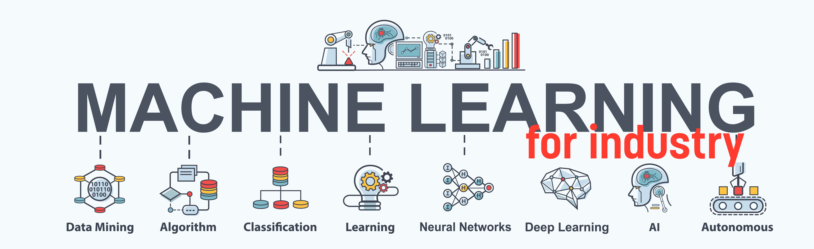
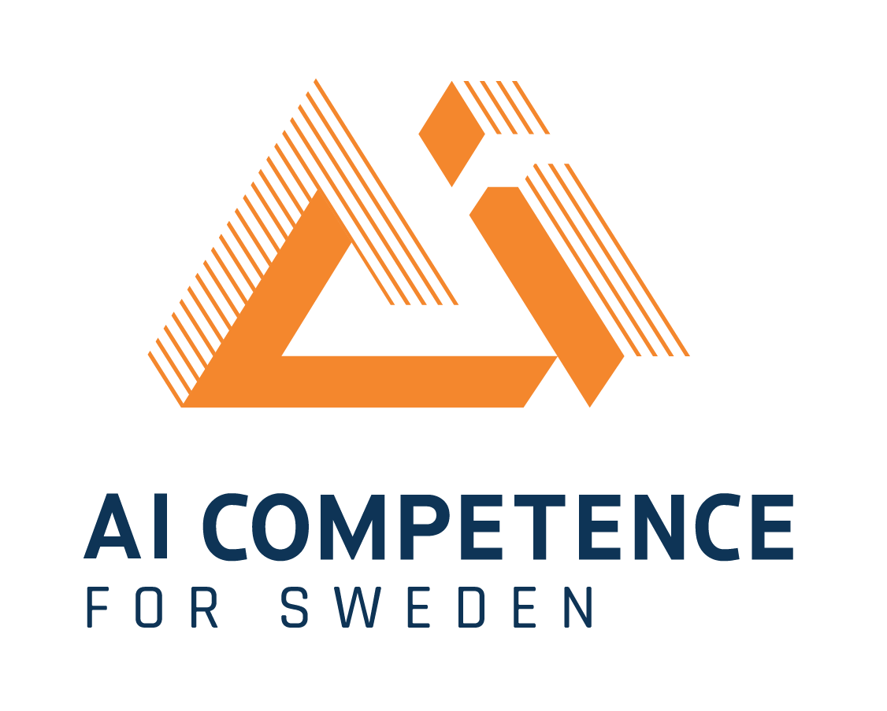

<!-- font: frutiger -->

---

### Topic 1 - Introduction to Machine Learning. Regularized Regression.

**Lecture block 1 - Basic ML principles and regularized regression** \
Reading: [Slides](/Slides/L1IntroRegression.pdf) | Chapters 1.1-1.3, 3.1-3.2 in [PRML](https://www.microsoft.com/en-us/research/uploads/prod/2006/01/Bishop-Pattern-Recognition-and-Machine-Learning-2006.pdf) | [PDSH: what is ML?](https://jakevdp.github.io/PythonDataScienceHandbook/05.01-what-is-machine-learning.html) | [PDSH: intro to scikit-learn](https://jakevdp.github.io/PythonDataScienceHandbook/05.02-introducing-scikit-learn.html) | [PDSH: hyperparameters and model validation](https://jakevdp.github.io/PythonDataScienceHandbook/05.03-hyperparameters-and-model-validation.html) | [PDSH: feature construction](https://colab.research.google.com/github/jakevdp/PythonDataScienceHandbook/blob/master/notebooks/05.04-Feature-Engineering.ipynb)\
Extras: [Demo linear regression in scikit-learn](./Extras/DemoLinReg.ipynb)

**Lecture block 2 - Trees, forests and beyond** \
Reading: [Slides](SLIDES) | [PDSH: Decision trees and Random forest](https://colab.research.google.com/github/jakevdp/PythonDataScienceHandbook/blob/master/notebooks/05.08-Random-Forests.ipynb) | [ESL: 9.2, 10.1-10.3](https://web.stanford.edu/~hastie/Papers/ESLII.pdf) | [XGboost article](http://cinslab.com/wp-content/uploads/2019/06/Ke-Wang-XGBoost-A-Scalable-Tree-Boosting-System.pdf)

**Computer lab 1 - Regularized regression and Tree models**\
[Problem 1](./Labs/Lab1a.ipynb)\
[Problem 2](./Labs/Lab1b.ipynb)

Lecturer: [Mattias Villani](https://mattiasvillani.com) \
Lab assistants: [Amanda Olmin](https://liu.se/en/employee/amaol67) and [Caroline Svahn](https://liu.se/medarbetare/carsv14)

### Topic 2 - Classification

**Lecture block 3 - Learning and Classification** \
Reading: [Slides](SLIDES) | Chapters 1.2.3, 1.2.6 in [PRML](https://www.microsoft.com/en-us/research/uploads/prod/2006/01/Bishop-Pattern-Recognition-and-Machine-Learning-2006.pdf).

**Lecture block 4 - Unsupervised learning** \
Reading: [Slides](/Slides/L4Unsupervised.pdf) | Chapters 9.1-9.2 in [PRML](https://www.microsoft.com/en-us/research/uploads/prod/2006/01/Bishop-Pattern-Recognition-and-Machine-Learning-2006.pdf) | [PDSH: k-means](https://colab.research.google.com/github/jakevdp/PythonDataScienceHandbook/blob/master/notebooks/05.11-K-Means.ipynb) | [PDSH: Gaussian mixture models](https://colab.research.google.com/github/jakevdp/PythonDataScienceHandbook/blob/master/notebooks/05.12-Gaussian-Mixtures.ipynb)

**Computer lab 2 - Classification and Mixture models**

Lecturer:  [Mattias Villani](https://mattiasvillani.com) \
Lab assistants: [Amanda Olmin](https://liu.se/en/employee/amaol67) and [Caroline Svahn](https://liu.se/medarbetare/carsv14)

### Topic 3 - Neural Networks and Deep Learning

**Lecture block 5 - XXX** \
Reading: [Slides](SLIDES) | Chapters X.X-Y.Y in [Book Name](book). \
Code: \
Other material:

**Lecture block 6 - XXX** \
Reading: [Slides](SLIDES) | Chapters X.X-Y.Y in [Book Name](book). \
Code: \
Other material:

Lecturer: Anders Eklund \
Lab assistant: David Abramian

### Topic 4 - Reinforcement Learning

**Lecture block 7 - XXX** \
Reading: Slides in LISAM | Chapters 1-7 in [RLI](http://incompleteideas.net/book/the-book.html). \
Code: \
Other material:

**Lecture block 8 - XXX** \
Reading: Slides in LISAM | Chapters 9, 10, 12, 13 and 16 in [RLI](http://incompleteideas.net/book/the-book.html). \
Code: \
Other material:

Lecturer: Jose M. Peña \
Lab assistant: Joel Oskarsson

### Course literature

  * Bishop [Pattern Recognition and Machine Learning](https://www.microsoft.com/en-us/research/uploads/prod/2006/01/Bishop-Pattern-Recognition-and-Machine-Learning-2006.pdf), Springer, 2006. **[PRML]**
  * VanderPlas [Python Data Science Handbook](https://jakevdp.github.io/PythonDataScienceHandbook/), O'Reilly, 2016. **[PDSH]**
  * Hastie, Tibshirani, Friedman [Elements of Statistical Learning](https://web.stanford.edu/~hastie/Papers/ESLII.pdf), Springer, 2008. **[ESL]**
  * Sutton, Barto [Reinforcement Learning: An Introduction](http://incompleteideas.net/book/the-book.html), MIT Press, 2018. **[RLI]**
  * Other material distributed on this web page under each topic.

### Teachers
 

##### **Lecturers**
[**Mattias Villani**](https://www.mattiasvillani.com/) \
Professor of Statistics \
Focus: Bayesian Statistics and Machine Learning

[**Jose M. Peña**](https://www.ida.liu.se/~jospe50/) \
Associate Professor in Computer Science \
Focus: Graphical Models and Causality

[**Anders Eklund**](https://liu.se/en/employee/andek67) \
Associate Professor in Medical Informatics \
Focus: Deep Learning and Neuroimaging

 

##### **Lab assistants**

[**Caroline Svahn**](https://liu.se/medarbetare/carsv14) \
WASP Industrial PhD student in Statistics \
Focus: Machine Learning for 5G networks

[**Amanda Olmin**](https://liu.se/en/employee/amaol67) \
WASP PhD student in Statistics \
Focus: Deep Learning and Bayesian Machine Learning

[**David Abramian**](https://liu.se/en/employee/davab27) \
Phd student in Medical Informatics \
Focus: Machine Learning for Neuroimaging

[**Joel Oskarsson**](https://se.linkedin.com/in/joel-oskarsson) \
Master student in Applied Physics and Electrical Engineering\
Focus: Machine Learning and Reinforcement Learning

### Course information
**The typical participant** has a degree in engineering, finance or other quantitative fields. We recommend that participants have taken at least one course in each of the following subjects:

* linear algebra
* calculus
* statistics
* programming

**Examination and Grades**: The report from each computer lab will be graded Pass or Fail. Successful completion of all five labs gives the grade Pass on the whole course.

**Course organization**
The course is organized in four topics, each containing six lecture hours and a computer lab.
